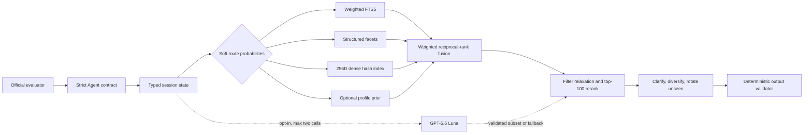

# Shopping Copilot technical report

## Executive result

Shopping Copilot is a headless, offline-first multi-turn retrieval agent. It
preserves the organizer's frozen 50,000-product catalog, exact-ASIN scoring,
ten-turn protocol, and `Agent.reset` / `Agent.respond` contract.

On the unmodified 200-session public evaluator, the frozen offline configuration
improves TechnicalScore from `0.106710` to `0.815322`.

## Architecture

### Catalog preparation

Every catalog field is normalized, including nested `details`, scalar/list text
variants, nulls, and malformed string prices. Startup constructs:

1. reliable material/color/brand/category facet maps;
2. field-weighted SQLite FTS5, emphasizing title then category/features/details;
3. 256-dimensional signed feature-hash vectors using catalog document frequency,
   capped term frequency, normalization, and a small fixed synonym map.

All structures are local and in memory. The catalog itself remains an ignored
organizer artifact.

### Conversation state and routing

`SessionState` stores route probabilities, typed evidence with confidence and
hardness, turn, intent generation, no-preference tombstones, profile priors,
token usage, and prior rejected recommendations. Hard evidence persists; soft
evidence decays by `0.84` per later turn.

State records diagnostic likelihoods for Buying, Browsing, Focused, and Override
instead of persisting a single brittle classification. The frozen scorer does
not treat those likelihoods as learned weights: evidence activates the relevant
routes, which use fixed, reproducible fusion weights. Compatible constraints
accumulate. An explicit override increments the intent generation, retains
category context, revokes older non-category evidence, clears tombstones, and
clears exclusions.

### Retrieval and clarification

Conjunctive/exact, structured, BM25, dense, category, and optional profile routes
produce catalog-valid candidates. Weighted reciprocal-rank fusion combines them.
Only reliable material/color/brand and parsed budget evidence can hard-filter.
Filters are applied strongest-first, and any filter that would empty the set is
relaxed immediately.

The top 100 are reranked with fused score, query coverage, title overlap, exact
evidence phrases, route agreement, and a small rating/popularity prior. After an
implicit rejection, already-seen top-10 products rotate behind unseen products;
overrides clear that exclusion set.

With no non-category hard constraint and more than 500 candidates or weak score
separation, the agent returns ten category/brand-diverse candidates and one
composite `ask_attribute="other"` question. Later questions maximize entropy over
available candidate facets, with practical fallbacks. Tombstoned attributes are
not repeated, and turn ten always returns `ask_attribute=null`.

### Optional OpenAI path

The optional implementation follows the OpenAI Responses API and GPT-5.6 Luna
model documentation:

- model `gpt-5.6-luna`;
- Structured Outputs with a strict JSON Schema;
- `reasoning.effort="none"`, `store=false`;
- distilled state plus at most 30 already-valid candidates;
- at most two calls per session, 2.5-second timeout, no retry;
- instance-wide 60-second circuit breaker after failure;
- deterministic validation of slot updates, query rewrite, candidate subset, and
  next attribute.

References:
[Responses API create](https://developers.openai.com/api/reference/cli/resources/responses/methods/create),
[GPT-5.6 Luna](https://developers.openai.com/api/docs/models/gpt-5.6-luna).

This path is disabled in the frozen configuration because no credentialed
holdout experiment was available. `OPENAI_API_KEY` was absent during all reported
runs. Explicit use additionally requires `SHOPPING_COPILOT_OPENAI=1`; otherwise
the network path is unreachable.

## Evaluation discipline

The split implementation is in `evaluation/run_public_eval.py`. It stratifies by
the released `(scenario_type, difficulty_bucket)` fields. Within each stratum,
SHA-256 order with seed `techjam-shopping-copilot-v1` assigns the first 20% to a
locked holdout: 16 Buying/easy, 16 Browsing/medium, 6 Override/hard, and 2
Boundary/medium sessions. The remaining 160 are the tuning set.

- Tuning IDs SHA-256: `2787f371644c4aec0069a494edd3f180771c5dbe87e28297ddb505dd335a9ce4`
- Holdout IDs SHA-256: `a98c19beed4fb935882f7d209def1548764cb0dafaf1772849291f886d5dc8fc`
- All-public IDs SHA-256: `653fa55317a4b659738e3a3e260f8af1a600071d1c668b3fcfedb727063a958b`

A pre-split architecture smoke run occurred before split locking and is excluded
from selection evidence. Component decisions then used only the 160-session
tuning set. The 40-session holdout was inspected once after freezing dense on,
profile ranking off, and network enhancement off. No configuration changed after
that holdout.

## Results

### Baseline to final, all 200 public sessions

| Metric | Weak baseline | Frozen offline agent | Change |
|---|---:|---:|---:|
| HitRate@10 | 0.125000 | 0.985000 | +0.860000 |
| MRR | 0.068034 | 0.556740 | +0.488706 |
| MTTC | 9.810000 | 3.210000 | -6.600000 |
| Efficiency | 0.119000 | 0.779000 | +0.660000 |
| TechnicalScore | 0.106710 | 0.815322 | +0.708612 |

### Final per-scenario metrics

| Scenario | N | HitRate@10 | MRR | MTTC |
|---|---:|---:|---:|---:|
| Buying | 80 | 1.000000 | 0.522302 | 2.975000 |
| Browsing | 80 | 1.000000 | 0.601518 | 2.187500 |
| Intent Override | 30 | 0.933333 | 0.488558 | 5.800000 |
| Boundary | 10 | 0.900000 | 0.678571 | 5.500000 |

### Locked holdout (one inspection)

| Metric | Value |
|---|---:|
| HitRate@10 | 0.950000 |
| MRR | 0.513115 |
| MTTC | 3.425000 |
| TechnicalScore | 0.780434 |

### Tuning ablations

This ablation suite started from the all-local candidate with state, structured,
dense, clarification, rotation, and profile routes enabled. OpenAI was unavailable
and made no calls. Scores are TechnicalScore on only the locked 160.

| Configuration | TechnicalScore | Finding |
|---|---:|---|
| Candidate default | 0.818240 | Comparison reference |
| Without state accumulation | 0.597048 | Keep state |
| Without structured retrieval | 0.807480 | Keep structured retrieval |
| Without dense retrieval | 0.820432 | Interaction tested further |
| Without clarification | 0.457953 | Keep clarification |
| Without candidate rotation | 0.772857 | Keep rotation |
| Without profile use | **0.824044** | Disable profile ranking by default |
| Without OpenAI | 0.818240 | No credentialed evidence; disable by default |

The combined dense-off/profile-off check scored `0.820839`, so the frozen choice
is dense on/profile off (`0.824044` on tuning). The anonymized profile remains in
typed state and the route remains available for future evidence-backed trials.

## Runtime, token, cost, and offline disclosures

Measured on the local macOS runner with Python 3.14.7, 50,000 products, and all
200 public sessions:

| Measure | Result |
|---|---:|
| Startup/index time | 17.027 s |
| `respond` calls | 639 |
| Response latency p50 | 20.677 ms |
| Response latency p95 | 55.521 ms |
| Response latency max | 121.880 ms |
| Peak RAM | 732.828 MB |
| Prompt tokens | 0 |
| Completion tokens | 0 |
| Actual API cost | $0.00 |

The final result is network-independent by configuration: OpenAI is off, no
third-party package or service is used, and API-failure tests verify immediate
fallback with one attempted call and no retry. The host itself was not placed in
an OS-level network namespace, so this is offline-path evidence rather than a
claim about network-isolation infrastructure.

Official GPT-5.6 Luna prices observed during implementation were $0.20 per million
input tokens and $1.20 per million output tokens. A conservative optional-session
estimate of two calls totaling 8,000 input and 1,000 output tokens is about
`$0.0028`; 200 such sessions would be about `$0.56`. This is an estimate only,
not measured spend, and current pricing/account access must be rechecked before
opting in.

## Verification and safety

The 17-test suite covers both entrypoints, reset-before-respond, strict schema,
unique valid recommendations, turn ten, deterministic sessions, state/override,
Boundary tombstones, soft decay, malformed catalog fields/prices, API timeout/no
retry/circuit breaker, and static prohibition on `ground_truth` or `public_set`
references in the runtime Agent module. The original evaluator tests remain
unchanged and pass.

The agent package never imports the public labels or evaluator. Evaluation and
demo helpers that verify target rank live in separate `evaluation/` and `demos/`
packages and are not imported by `agent.py`.

## Limitations

- Peak RAM is roughly 733 MB because FTS5, normalized text, facets, and dense
  vectors are all resident; a constrained judge may require a disk-backed index.
- Boundary has only ten public examples, so its estimate has high variance.
- Override cannot score before the official new intent, making its minimum MTTC
  inherently higher.
- The dense index is hash-based rather than a pretrained semantic embedding.
- Profile ranking and OpenAI enhancement are implemented but disabled because
  tuning/holdout evidence did not justify enabling them.

## Team contributions

Khansa and Naaman jointly contributed across problem framing, system
architecture, implementation, evaluation, documentation, and demo preparation.
